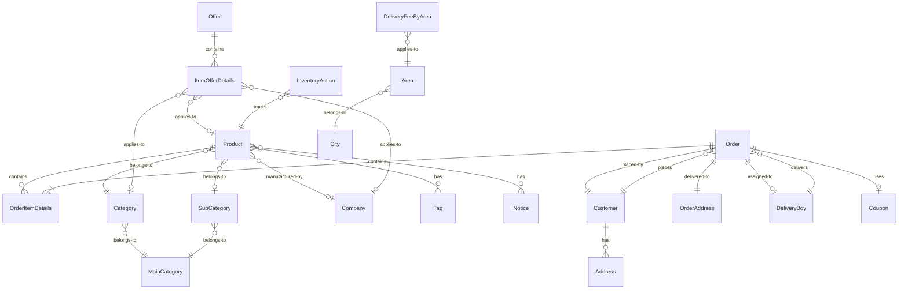

# MasShop Data Models Documentation

## Table of Contents
1. [Overview](#overview)
2. [Core Entities](#core-entities)
   - [Products](#products)
   - [Orders](#orders)
   - [Users](#users)
   - [Categories](#categories)
   - [Companies](#companies)
3. [Supporting Entities](#supporting-entities)
   - [Inventory](#inventory)
   - [Promotions](#promotions)
   - [Address & Delivery](#address--delivery)
   - [Store Configuration](#store-configuration)
4. [Entity Relationships](#entity-relationships)
5. [Design Patterns](#design-patterns)
6. [Database Schema](#database-schema)

## Overview

The MasShop data model is designed to support a multi-mode e-commerce platform that handles both retail and wholesale operations. The system features:

- **Bilingual Support**: Arabic and English for all text fields
- **Multi-Unit Products**: Products can be sold in different units (big/small)
- **Flexible Pricing**: Multiple pricing strategies including special prices
- **Comprehensive Tracking**: Full audit trails and soft deletes
- **Role-Based Access**: Different user types with specific permissions

## Core Entities

### Products

The product system supports both retail and wholesale operations with comprehensive product information management.

#### RetailProduct Interface
```typescript
interface RetailProduct {
  id: number;
  nameEN: string;
  nameAR: string;
  descriptionEN?: string;
  descriptionAR?: string;
  
  // Categorization
  categoryId: number;
  subCategoryId?: number;
  tagIds: number[];
  noticeIds: number[];
  
  // Units and Pricing
  bigUnitId: number;
  bigUnitPrice: number;
  bigUnitSpecialPrice?: number;
  smallUnitId: number;
  smallUnitQuantity: number;
  smallUnitPrice: number;
  smallUnitSpecialPrice?: number;
  
  // Tax Information
  bigUnitTaxPercentage: number;
  bigUnitVATPercentage: number;
  smallUnitTaxPercentage: number;
  smallUnitVATPercentage: number;
  
  // Inventory
  bigUnitStock: number;
  smallUnitStock: number;
  
  // Product Features
  hasExpiration: boolean;
  expirationNumber?: number;
  expirationType?: 'Day' | 'Week' | 'Month' | 'Year';
  isSoldByWeight: boolean;
  barcodeNumber?: string;
  
  // Nutritional Information
  calories?: number;
  protein?: number;
  totalFat?: number;
  saturatedFat?: number;
  transFat?: number;
  cholesterol?: number;
  carbohydrates?: number;
  fiber?: number;
  sugars?: number;
  sodium?: number;
  calcium?: number;
  iron?: number;
  vitaminA?: number;
  vitaminC?: number;
  
  // Metadata
  isActive: boolean;
  createdAt: Date;
  modifiedAt: Date;
}
```

#### WholeSaleProduct Interface
```typescript
interface WholeSaleProduct extends RetailProduct {
  companyId: number;
  customValue?: number;
  flavourIds: number[];
}
```

#### FullProduct Interface
```typescript
interface FullProduct extends WholeSaleProduct {
  // Resolved relationships
  category: Category;
  subCategory?: SubCategory;
  company?: Company;
  tags: Tag[];
  notices: Notice[];
  flavours: Flavour[];
  
  // Images
  bigUnitImageUrl?: string;
  smallUnitImageUrl?: string;
}
```

### Orders

The order system manages the complete order lifecycle from placement to delivery.

#### Order Interface
```typescript
interface Order {
  orderEznNo: string;          // Unique order number
  status: OrderStatus;
  subStatus?: string;
  
  // Customer Information
  customer: OrderCustomer;
  address: OrderAddress;
  
  // Order Details
  itemDetails: OrderItemDetails[];
  
  // Financial Information
  subTotal: number;
  vat: number;
  tax: number;
  discountByPoints: number;
  couponDisVal: number;
  deliveryFee: number;
  total: number;
  tip?: number;
  
  // Payment Information
  paymentMethod: PaymentMethod;
  paymentMethodId: string;
  isPaymentDone: boolean;
  isPaymentVerified: boolean;
  paymentTransactionReference?: string;
  
  // Delivery Information
  deliveryBoyName?: string;
  deliveryFeeInfo: DeliveryFeeInfo;
  
  // Additional Information
  rating?: number;
  notes?: string;
  preferredDeliveryDateTime?: Date;
  
  // Timestamps
  createdAt: Date;
  updatedAt: Date;
}
```

#### OrderStatus Enum
```typescript
enum OrderStatus {
  Pending = 0,
  Accepted = 1,
  Processing = 2,
  Ready = 3,
  OutForDelivery = 4,
  Delivered = 5,
  Cancelled = 6,
  Rejected = 7
}
```

#### OrderItemDetails Interface
```typescript
interface OrderItemDetails {
  itemNameEn: string;
  itemNameAr: string;
  itemUnit: string;
  itemPrice: number;
  itemQuantity: number;
  itemTotalPrice: number;
  itemOffer: number;
  itemOfferPrice: number;
  itemSpecialPrice: number;
  itemTaxAmount: number;
  itemVATAmount: number;
  itemDiscount: number;
  itemTotal: number;
  itemNotes?: string;
}
```

### Users

The system supports three main user types with different roles and permissions.

#### Customer Interface
```typescript
interface Customer {
  id: string;
  name: string;
  email: string;
  phone: string;
  profileImage?: string;
  
  // Authentication
  isActive: boolean;
  isEmailConfirmed: boolean;
  isPhoneNumberConfirmed: boolean;
  
  // Customer Features
  walletBalance: number;
  points: number;
  referralCode: string;
  hasReferralCode: boolean;
  
  // Preferences
  notificationSettings: NotificationSettings;
  languagePreference: 'en' | 'ar';
  
  // Order Limits
  maxOrdersPerDay: number;
  maxOrderAmount: number;
  
  // Timestamps
  registeredAt: Date;
  lastLoginAt: Date;
}
```

#### DeliveryBoy Interface
```typescript
interface DeliveryBoy {
  id: string;
  name: string;
  email: string;
  phone: string;
  
  // Status
  isActive: boolean;
  isAvailable: boolean;
  
  // Performance
  totalDeliveries: number;
  averageRating: number;
  
  // Location
  currentLocation?: {
    latitude: number;
    longitude: number;
  };
  
  // Timestamps
  createdAt: Date;
  modifiedAt: Date;
}
```

### Categories

Three-level hierarchical categorization system for products.

#### MainCategory Interface
```typescript
interface MainCategory {
  id: number;
  nameEn: string;
  nameAr: string;
  noteEN?: string;
  noteAR?: string;
  arrange: number;        // Display order
  isActive: boolean;
  createdAt: Date;
  modifiedAt: Date;
}
```

#### Category Interface
```typescript
interface Category {
  id: number;
  nameEn: string;
  nameAr: string;
  mainCategoryId: number;
  noteEN?: string;
  noteAR?: string;
  imageUrl?: string;
  arrange: number;
  isActive: boolean;
  createdAt: Date;
  modifiedAt: Date;
}
```

#### SubCategory Interface
```typescript
interface SubCategory {
  id: number;
  nameEn: string;
  nameAr: string;
  mainCategoryId: number;
  noteEN?: string;
  noteAR?: string;
  arrange: number;
  isActive: boolean;
  createdAt: Date;
  modifiedAt: Date;
}
```

### Companies

Manufacturers and suppliers for wholesale operations.

#### Company Interface
```typescript
interface Company {
  id: number;
  nameEn: string;
  nameAr: string;
  noteEN?: string;
  noteAR?: string;
  imageUrl?: string;
  isActive: boolean;
  
  // Associated categories
  categories: Category[];
  
  // Banner images for marketing
  bannerImages?: string[];
  
  // Timestamps
  createdAt: Date;
  modifiedAt: Date;
}
```

## Supporting Entities

### Inventory

#### InventoryAction Interface
```typescript
interface InventoryAction {
  id: number;
  itemId: number;
  stockVal: number;
  action: InventoryActionType;
  notes?: string;
  createdAt: Date;
  createdBy: string;
}

enum InventoryActionType {
  Sold = 1,
  Restocked = 2,
  Returned = 3
}
```

### Promotions

#### Offer Interface
```typescript
interface Offer {
  id: number;
  nameEn: string;
  nameAr: string;
  isSpecialOffer: boolean;
  imageUrl?: string;
  startDate: Date;
  endDate: Date;
  isActive: boolean;
  createdAt: Date;
  modifiedAt: Date;
}
```

#### ItemOfferDetails Interface
```typescript
interface ItemOfferDetails {
  id: number;
  offerId: number;
  itemId?: number;
  companyId?: number;
  categoryId?: number;
  discountType: DiscountType;
  discountValue: number;
  maxDiscountAmount?: number;
}

enum DiscountType {
  Percentage = 0,
  FixedAmount = 1
}
```

#### Coupon Interface
```typescript
interface Coupon {
  code: string;
  descriptionEn: string;
  descriptionAr: string;
  discountType: DiscountType;
  discountValue: number;
  minimumOrderAmount: number;
  maximumDiscountAmount?: number;
  
  // Usage Limits
  usageLimit: number;
  usageCount: number;
  usageLimitPerUser: number;
  
  // Validity
  startDate: Date;
  endDate: Date;
  validFrom: string;    // Time of day (HH:mm)
  validTo: string;      // Time of day (HH:mm)
  
  isActive: boolean;
  createdAt: Date;
  modifiedAt: Date;
}
```

### Address & Delivery

#### FullAddress Interface
```typescript
interface FullAddress {
  id: number;
  addressLine1: string;
  addressLine2?: string;
  buildingName?: string;
  floorNumber?: string;
  apartmentNumber?: string;
  
  // Location
  areaId: number;
  area: Area;
  cityId: number;
  city: City;
  
  // GPS Coordinates
  latitude: number;
  longitude: number;
  
  // Additional Info
  landmark?: string;
  deliveryInstructions?: string;
  
  isDefault: boolean;
  createdAt: Date;
  modifiedAt: Date;
}
```

#### DeliveryFee Interfaces
```typescript
interface DeliveryFeeByArea {
  id: number;
  areaId: number;
  fee: number;
  estimatedTime: number;  // In minutes
  isActive: boolean;
}

interface DeliveryFeeByDistance {
  id: number;
  fromDistance: number;   // In kilometers
  toDistance: number;
  fee: number;
  estimatedTime: number;
  isActive: boolean;
}
```

### Store Configuration

#### StoreSettings Interface
```typescript
interface StoreSettings {
  id: number;
  storeNameEn: string;
  storeNameAr: string;
  
  // Business Rules
  appMode: 'RetailMarket' | 'WholeSale' | 'Both';
  isInventoryTracked: boolean;
  
  // Order Configuration
  minimumOrderAmount: number;
  orderAutoRejectTime: number;  // In minutes
  isDeliveryEnabled: boolean;
  isTipsEnabled: boolean;
  isRatingsEnabled: boolean;
  
  // Delivery Settings
  deliveryFeeType: 'ByArea' | 'ByDistance';
  deliveryRadius: number;       // In kilometers
  
  // Points & Rewards
  isReferralSystemActive: boolean;
  referralSenderPoints: number;
  referralReceiverPoints: number;
  percentageForPoints: number;
  
  // Working Hours
  workingHours: {
    [key: string]: {
      isOpen: boolean;
      openTime: string;
      closeTime: string;
    };
  };
  
  // Tax Configuration
  taxPercentage: number;
  vatPercentage: number;
  
  createdAt: Date;
  modifiedAt: Date;
}
```

## Entity Relationships

### Primary Relationships



### Key Relationships Explained

1. **Product Hierarchy**:
   - Products belong to Categories
   - Categories belong to Main Categories
   - Products can optionally belong to Sub-Categories
   - Wholesale products must have a Company

2. **Order Flow**:
   - Orders are placed by Customers
   - Orders contain multiple Order Item Details
   - Each Order Item Detail references a Product
   - Orders are delivered to an Address
   - Orders can be assigned to a Delivery Boy

3. **Promotional Relationships**:
   - Offers can apply to individual Products, entire Companies, or Categories
   - Coupons are applied at the Order level
   - Products can have special prices independent of offers

4. **Inventory Tracking**:
   - Inventory Actions track all stock movements
   - Each action references a specific Product
   - Actions are categorized (Sold, Restocked, Returned)

## Design Patterns

### 1. Bilingual Support Pattern
All user-facing entities include both English and Arabic fields:
```typescript
interface BilingualEntity {
  nameEn: string;
  nameAr: string;
  descriptionEn?: string;
  descriptionAr?: string;
}
```

### 2. Soft Delete Pattern
Entities use `isActive` flags instead of hard deletes:
```typescript
interface SoftDeletable {
  isActive: boolean;
}
```

### 3. Audit Trail Pattern
All entities include timestamps:
```typescript
interface Auditable {
  createdAt: Date;
  modifiedAt: Date;
  createdBy?: string;
  modifiedBy?: string;
}
```

### 4. API Response Pattern
Consistent response structure:
```typescript
interface ApiResponse<T> {
  result: {
    code: number;
    message: string;
  };
  data: T | null;
}
```

### 5. Paginated Response Pattern
For list endpoints:
```typescript
interface PaginatedResponse<T> {
  items: T[];
  pageNumber: number;
  pageSize: number;
  totalCount: number;
  totalPages: number;
}
```

## Database Schema

### Estimated Database Structure

Based on the TypeScript interfaces, the database likely follows this structure:

#### Products Table
```sql
CREATE TABLE Products (
  id INT PRIMARY KEY,
  nameEN NVARCHAR(255) NOT NULL,
  nameAR NVARCHAR(255) NOT NULL,
  descriptionEN NVARCHAR(MAX),
  descriptionAR NVARCHAR(MAX),
  categoryId INT FOREIGN KEY REFERENCES Categories(id),
  subCategoryId INT FOREIGN KEY REFERENCES SubCategories(id),
  companyId INT FOREIGN KEY REFERENCES Companies(id),
  bigUnitId INT FOREIGN KEY REFERENCES ItemUnits(id),
  bigUnitPrice DECIMAL(10,2),
  bigUnitStock INT,
  smallUnitId INT FOREIGN KEY REFERENCES ItemUnits(id),
  smallUnitPrice DECIMAL(10,2),
  smallUnitStock INT,
  isActive BIT,
  createdAt DATETIME,
  modifiedAt DATETIME
);
```

#### Orders Table
```sql
CREATE TABLE Orders (
  orderEznNo VARCHAR(50) PRIMARY KEY,
  customerId VARCHAR(128) FOREIGN KEY REFERENCES Users(id),
  status INT,
  subTotal DECIMAL(10,2),
  vat DECIMAL(10,2),
  tax DECIMAL(10,2),
  deliveryFee DECIMAL(10,2),
  total DECIMAL(10,2),
  paymentMethod INT,
  isPaymentDone BIT,
  deliveryBoyId VARCHAR(128) FOREIGN KEY REFERENCES Users(id),
  createdAt DATETIME,
  updatedAt DATETIME
);
```

#### Many-to-Many Relationship Tables
```sql
-- Product Tags
CREATE TABLE ProductTags (
  productId INT FOREIGN KEY REFERENCES Products(id),
  tagId INT FOREIGN KEY REFERENCES Tags(id),
  PRIMARY KEY (productId, tagId)
);

-- Product Notices
CREATE TABLE ProductNotices (
  productId INT FOREIGN KEY REFERENCES Products(id),
  noticeId INT FOREIGN KEY REFERENCES Notices(id),
  PRIMARY KEY (productId, noticeId)
);
```

### Index Recommendations

For optimal performance, consider these indexes:

1. **Products**: 
   - Index on (categoryId, isActive)
   - Index on (companyId, isActive)
   - Full-text index on (nameEN, nameAR)

2. **Orders**:
   - Index on (customerId, createdAt)
   - Index on (status, createdAt)
   - Index on (deliveryBoyId, status)

3. **Inventory**:
   - Index on (itemId, createdAt)
   - Index on (action, createdAt)

## Conclusion

The MasShop data model provides a robust foundation for a multi-mode e-commerce platform. Key strengths include:

1. **Flexibility**: Supports both retail and wholesale operations
2. **Internationalization**: Full bilingual support
3. **Scalability**: Well-structured relationships and indexes
4. **Auditability**: Comprehensive tracking and soft deletes
5. **Extensibility**: Clean interfaces allow for easy additions

The model follows modern design patterns and best practices, making it maintainable and adaptable to future business requirements.